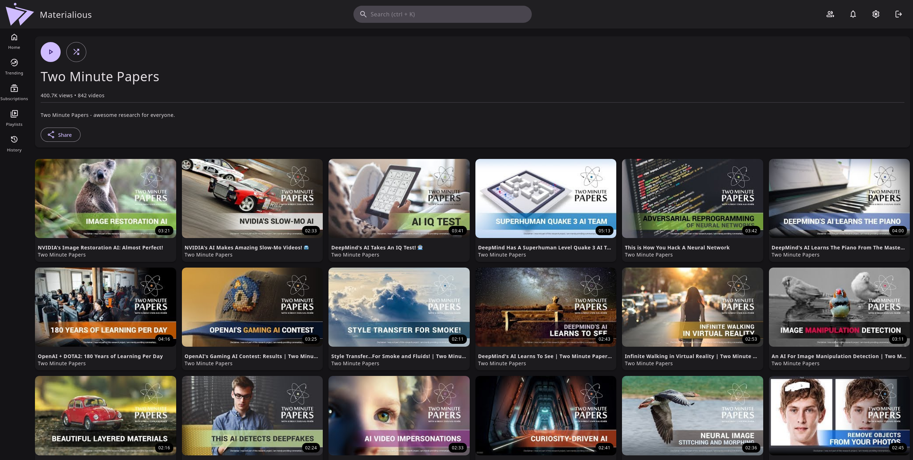

<div align="center">
  
  <quote>
  Modern material design for Invidious.
  </quote>
</div>

&nbsp;

-------


[Help translate Materialious!](https://fink.inlang.com/github.com/WardPearce/Materialious)

# Features
- Watch sync parties!
- Sponsorblock built-in.
- Return YouTube dislikes built-in.
- DeArrow built-in (With local processing fallback).
- Video progress tracking & resuming.
- No ads.
- No tracking.
- Light/Dark themes.
- Custom colour themes.
- Integrates with Invidious subscriptions, watch history & more.
- Live stream support.
- Dash support.
- Chapters.
- Audio only mode.
- Playlists.
- PWA support.
- YT path redirects (So your redirect plugins should still work!)

# Public instances
- [materialio.us](https://materialio.us)
  - **Location:** New Zealand
  - **Threads:** 6
  - **Twice daily IPV6 rotation:** Yes
  - **Cloudflare:** No
  - **Accounts:** Yes

Open an issue to add your instance.

# Setup
For security reasons regarding CORS, your hosted instance of Materialious must serve as the value for the `Access-Control-Allow-Origin` header on Invidious.

Invidious doesn't provide a simple way to modify CORS, so this must be done with your reverse proxy.

## Step 1: Reverse proxy
### Caddy example
```caddyfile
invidious.example.com {
	@cors_preflight {
		method OPTIONS
	}
	respond @cors_preflight 204

	header Access-Control-Allow-Credentials true
        header Access-Control-Allow-Origin "https://materialious.example.com" {
		defer
	}
        header Access-Control-Allow-Methods "GET,POST,OPTIONS,HEAD,PATCH,PUT,DELETE"
        header Access-Control-Allow-Headers "User-Agent,Authorization,Content-Type"

	reverse_proxy localhost:3000
}

materialious.example.com {
	reverse_proxy localhost:3001
}
```

### Nginx example
```nginx
server {
    listen 80;
    server_name invidious.example.com;

    location / {
        if ($request_method = OPTIONS) {
            return 204;
        }

        proxy_hide_header Access-Control-Allow-Origin;
        add_header Access-Control-Allow-Credentials true;
        add_header Access-Control-Allow-Origin "https://materialious.example.com" always;
        add_header Access-Control-Allow-Methods "GET, POST, OPTIONS, HEAD, PATCH, PUT, DELETE" always;
        add_header Access-Control-Allow-Headers "User-Agent, Authorization, Content-Type" always;

        proxy_pass http://localhost:3000;
    }
}

server {
    listen 80;
    server_name materialious.example.com;

    location / {
        proxy_pass http://localhost:3001;
    }
}
```

### Traefik example
Add this middleware to your Invidious instance:
```yaml
http:
  middlewares:
    materialious:
      headers:
        accessControlAllowCredentials: true
        accessControlAllowOriginList: "https://materialious.example.com"
        accessControlAllowMethods:
          - GET
          - POST
          - OPTIONS
          - HEAD
          - PATCH
          - PUT
          - DELETE
        accessControlAllowHeaders: 
          - User-Agent
          - Authorization 
          - Content-Type
```

### Other
Please open a PR request or issue if you implement this in a different reverse proxy.

## Step 2: Invidious config
The following Invidious values must be set in your config.

- `domain:` - The reverse proxied domain of your Invidious instance.
- `https_only: true` - Must be set if you are using HTTPS.
- `external_port: 443` - Must be set if you are using HTTPS.


## Step 3: Docker
Please ensure you have followed the previous steps before doing this!

```yaml
version: "3"
services:
  materialious:
    image: wardpearce/materialious:latest
    restart: unless-stopped
    ports:
      - 3001:80
    environment:
      # No trailing backslashes!
      # URL to your proxied Invidious instance
      VITE_DEFAULT_INVIDIOUS_INSTANCE: "https://invidious.materialio.us"

      # URL TO RYD
      # Leave blank to disable completely.
      VITE_DEFAULT_RETURNYTDISLIKES_INSTANCE: "https://returnyoutubedislikeapi.com"

      # URL to your proxied instance of Materialious
      VITE_DEFAULT_FRONTEND_URL: "https://materialio.us"

      # URL to Sponsorblock
      # Leave blank to completely disable sponsorblock.
      VITE_DEFAULT_SPONSERBLOCK_INSTANCE: "https://sponsor.ajay.app"

      # URL to DeArrow
      VITE_DEFAULT_DEARROW_INSTANCE: "https://sponsor.ajay.app"

      # URL to DeArrow thumbnail instance
      VITE_DEFAULT_DEARROW_THUMBNAIL_INSTANCE: "https://dearrow-thumb.ajay.app"
```

## Step 4 (Optional, but recommended): Self-host RYD-Proxy

### Step 1: Docker compose
Add the following to your docker compose file.

#### With TOR (Recommended)
```yml
tor-proxy:
  image: 1337kavin/alpine-tor:latest
  restart: unless-stopped
  environment:
    - tors=15

ryd-proxy:
  image: 1337kavin/ryd-proxy:latest
  restart: unless-stopped
  depends_on:
    - tor-proxy
  environment:
    - PROXY=socks5://tor-proxy:5566
  ports:
    - "127.0.0.1:3003:3000"
```
#### Without TOR
```yml
ryd-proxy:
  image: 1337kavin/ryd-proxy:latest
  restart: unless-stopped
  ports:
    - "127.0.0.1:3003:3000"
```

### Step 2:
Reverse proxy RYD-Proxy.

#### Caddy example
```caddy
ryd-proxy.example.com {
  header Access-Control-Allow-Origin "https://materialious.example.com" {
      defer
  }
  header Access-Control-Allow-Methods "GET,OPTIONS"
  reverse_proxy localhost:3003
}
```

#### Nginx example
```nginx
server {
    listen 80;
    server_name ryd-proxy.example.com;

    location / {
        add_header Access-Control-Allow-Origin "https://materialious.example.com" always;
        add_header Access-Control-Allow-Methods "GET, OPTIONS" always;
        proxy_pass http://localhost:3003;
    }
}
```

#### Traefik example
Add this middleware to your RYD-Proxy instance:
```yaml
http:
  middlewares:
    ryd-proxy:
      headers:
        accessControlAllowOriginList: "https://materialious.example.com"
        accessControlAllowMethods:
          - GET
          - OPTIONS
```

### Step 3:
Modify/add `VITE_DEFAULT_RETURNYTDISLIKES_INSTANCE` for Materialious to be the reverse proxied URL of RYD-Proxy.

## Step 5 (Optional): Self-host PeerJS
[Read the official guide.](https://github.com/peers/peerjs-server?tab=readme-ov-file#docker)

Add these additional environment variables to Materialious.
```yaml
# Will differ depending on how you self-host peerjs.
VITE_DEFAULT_PEERJS_HOST: "peerjs.example.com"
VITE_DEFAULT_PEERJS_PATH: "/"
VITE_DEFAULT_PEERJS_PORT: 443
```

# Previews

## Mobile


## Player


## Settings


## Channel


## Chapters


## Playlists



# Have any questions?
[Join our Matrix space](https://matrix.to/#/#ward:matrix.org)

# Special thanks to
- [Invidious](https://github.com/iv-org)
- [Clipious](https://github.com/lamarios/clipious) for inspiration & a good source for learning more about undocumented Invidious routes.
- [Vidstack player](https://github.com/vidstack/player)
- [Beer CSS](https://github.com/beercss/beercss) (Especially the [YouTube template](https://github.com/beercss/beercss/tree/main/src/youtube) what was used as the base for Materialious.)
- Every dependency in [package.json](/materialious/package.json).
